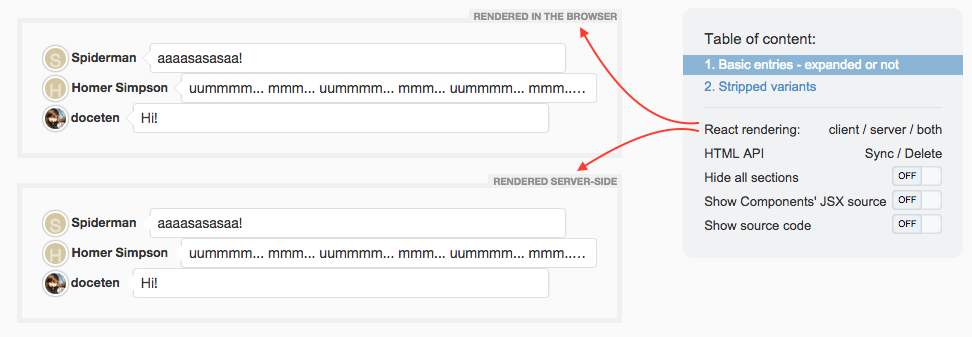
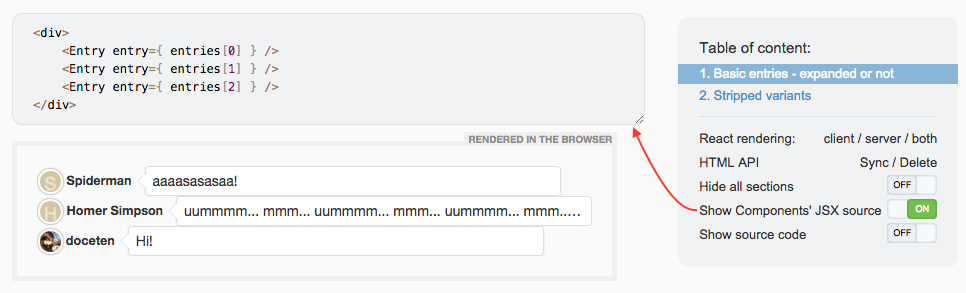

# SourceJS MD-React plugin

A React plugin for [SourceJS](http://sourcejs.com), for using React/JSX components in Markdown specs.

[](https://gitter.im/sourcejs/Source)

Compatible with SourceJS 0.5.4+.


## Screenshots: seeing is believing

Client- and server-side rendering of React components:



Original JSX source preview:




## Quick start

Install the plugin in `sourcejs/user` folder:

```bash
npm install sourcejs-md-react --save
```

Then prepare markdown options in your project's `options.js`:

```js
module.exports = {
    core: {
        processMd: {
            languageRenderers: {
                'jsx-init-server': require('sourcejs-md-react/lang-jsx').processServerInit,
                'jsx-init-client': require('sourcejs-md-react/lang-jsx').processClientInit,
                'jsx-component-init-common': require('sourcejs-md-react/lang-jsx').processComponentInit,
                'jsx': require('sourcejs-md-react/lang-jsx').processExample,
            }
        }
        // ...
    }
    // ...
};
```

(Just merge the code aboe with your current options.)

**NOTE: Hopefully this process will get easier. Stay tuned.**


## Usage

Put this in your `specs/something/readme.md`:

    ```jsx-init-server
    // Put your server-side initialization code here
    var MyGreatBox = require('my-cool-library/ui/MyGreatBox');
    ```
    ```jsx-init-client
    // Put your client-side initialization and rendering code here
    require(['http://some.server/myCoolLibrary/bundle.js'], function(bundle) {
        var MyGreatBox = bundle.MyGreatBox;
        var React = bundle.React;
        React.render(COMPONENT, ELEMENT);
    });
    ```
    ```jsx-component-init-common
    // Put your mock data here
    var data = {title: 'Hello!'};
    ```

    # MyGreatBox

    ## MyGreatBox (default)

    ```jsx
    <MyGreatBox data={ data }>Hello world</MyGreatBox>
    ```

    ## MyGreatBox (with custom color)

    ```jsx
    // You can use variables, comments and anything JSX here.
    var c = '#df444d';
    <MyGreatBox data={ data } color={ c } size="huge">Here I am</MyGreatBox>
    ```


## FAQ / Common problems

Q: **The items in menu don't show up.**  
A: Go to the `node_modules/sourcejs` folder and run `grunt update`.

## Thanks to

* @operatino for [SourceJS](http://sourcejs.com) and his support
* @szarouski for his original [React plugin for SourceJS](https://github.com/szarouski/sourcejs-react).

## Contributing

Yes! Please write some unit-tests! :)
